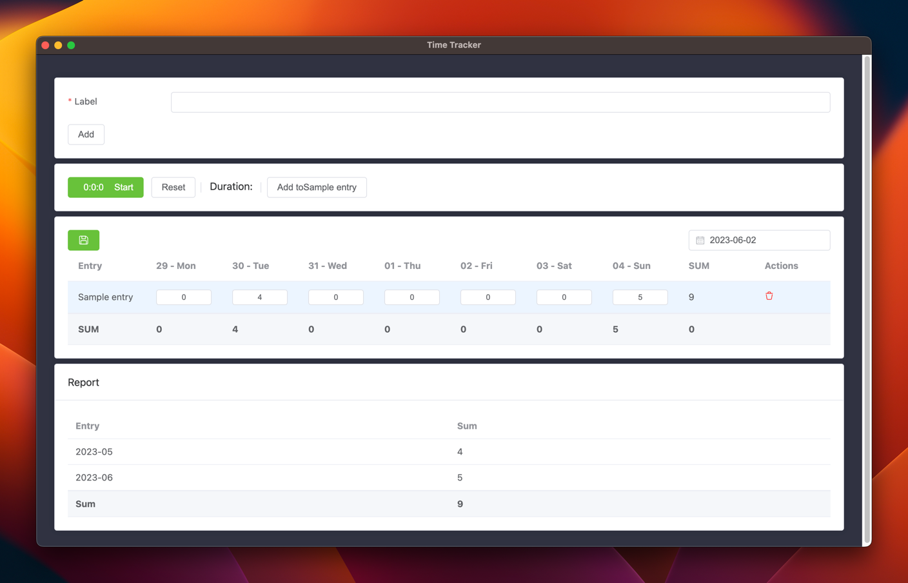

# NTracker

<div align="center">
  
</div>

## Introduction
You can easily track your work on a time basis with NTracker.
You can manage your work more easily and report your records with less difficulty.

## Built With
[![Next][Next.js]][Next-url]

## 🚀Features

TODO

## 🖥️ Download & Install

TODO

## 🚧 Roadmap

TODO

## 🧑‍💻 Running Development

Local development requires at least Node v16 installed.

Clone repo

```shell
clone git https://github.com/kutay-celebi/ntracker
```

Install dependencies

```shell
pnpm install
```

Run with dev env.

```shell
pnpm dev
```

## ✍️ Contributing

TODO
