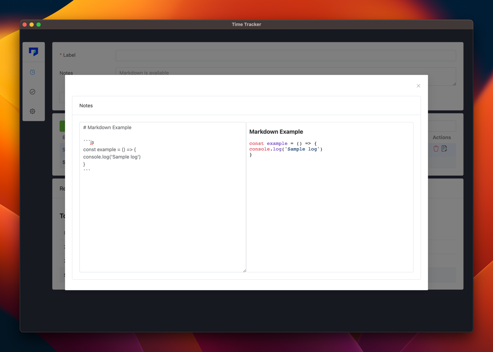

<div align="center">
  
</div>

<div align="center">
  <a href="https://github.com/kutay-celebi/ntracker/actions/workflows/release.yml">
    
  </a>

  <a href="https://github.com/kutay-celebi/ntracker/releases">
    
  </a>

  <a href="https://github.com/kutay-celebi/ntracker/releases/latest">
    
  </a>

  <a href="https://www.buymeacoffee.com/kutaycelebi" target="_blank"></a>
</div>

## Introduction

You can easily track your work on a time basis with NTrack.
You can manage your work more easily and report your records with less difficulty.

## Screenshots

<div align="center">
  
  
  
  
</div>

## Built With


## 🚀Features

<div>📍 Save your daily to-do tasks.</div>
<div>📍 Organize your saved to-do.</div>
<div>📍 Track the time of your work on a daily basis. </div>
<div>📍 Start a timer for a task that you are busy with and record the time elapsed.</div>
<div>📍 Customize the application as you like.</div>


## 🖥️ Download & Install

Download the latest version from the releases page.


[](https://github.com/kutay-celebi/ntracker/releases/download/1.2.0/ntrack-1.2.0-setup.exe)
[](https://github.com/kutay-celebi/ntracker/releases/download/1.2.0/ntrack-1.2.0-setup.exe)
[](https://github.com/kutay-celebi/ntracker/releases/download/1.2.0/ntrack-1.2.0.dmg)
[](https://github.com/kutay-celebi/ntracker/releases/download/1.2.0/ntrack-1.2.0.AppImage)


## 🧑‍💻 Running Development

Local development requires at least Node v16 installed.

Clone repo

```shell
clone git https://github.com/kutay-celebi/ntracker
```

Install dependencies

```shell
pnpm install
```

Run with dev env.

```shell
pnpm dev
```

## ✍️ Contributing

TODO
